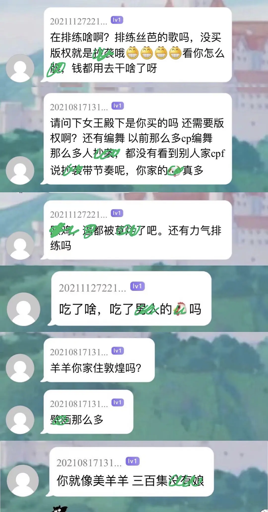
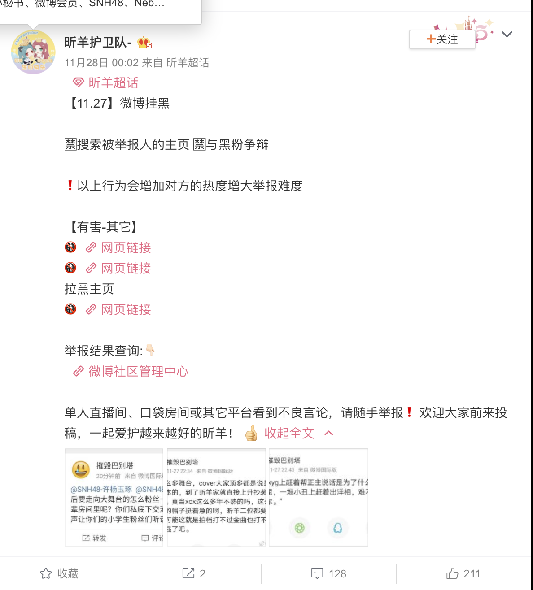
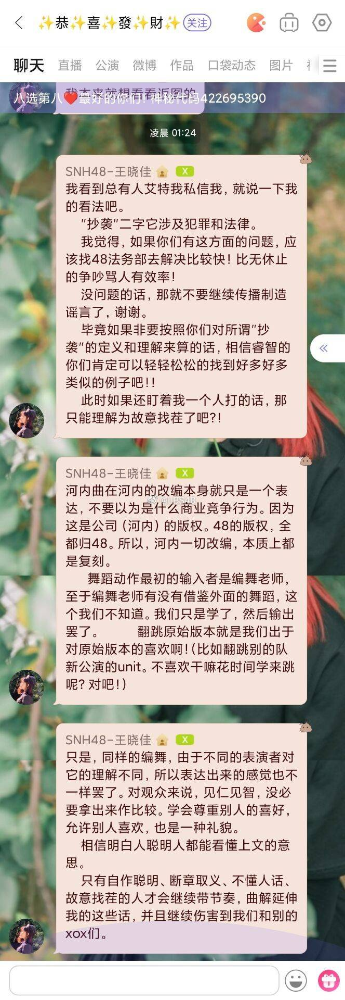
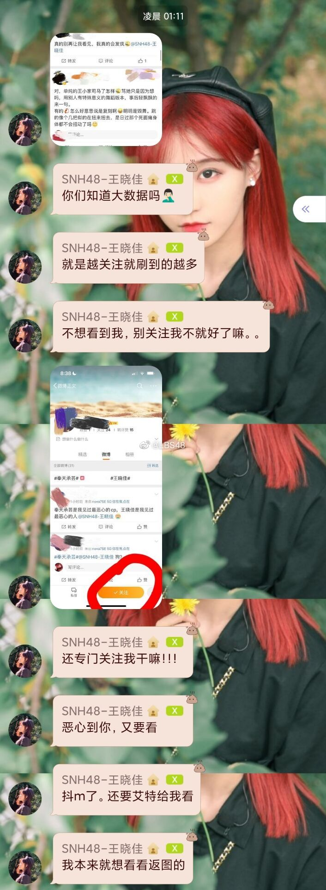
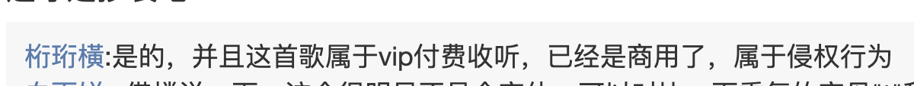
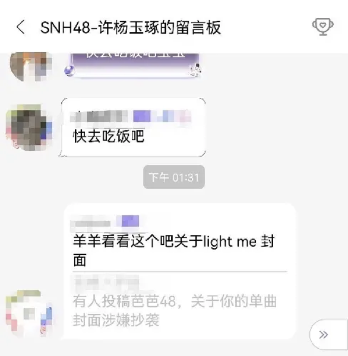
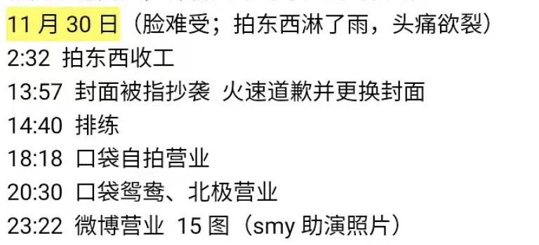
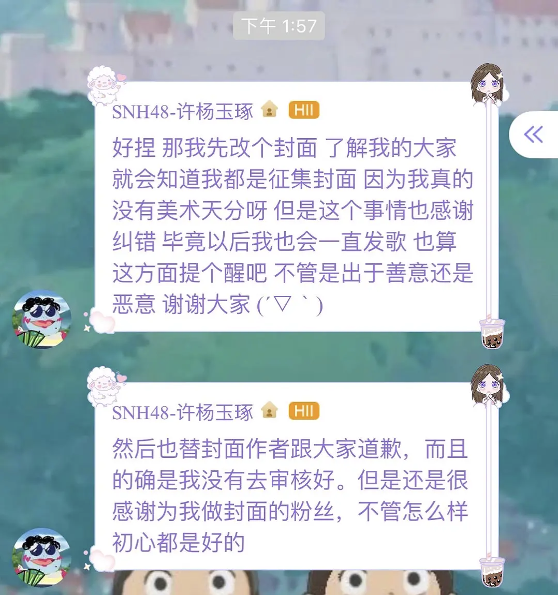
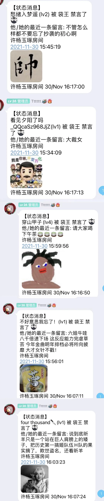

## 女王殿下事件始末
1. 本文档只用于当别人造谣时反黑用，请勿带入情绪。
2. 如果有需要对时间线的疏漏提出新的证据，请在issue页面提出。
3. 新证据提出时请写清楚截图时间和具体事件，最好时截图上时间戳清晰。
4. 欢迎扩散
5. 诚招网页前端开发，如果可能，打算做成网页挂在我的域名下。

## 时间线
|  时间   |  粉丝发言 |  许杨玉琢  |  王晓佳  |  应援会公告  |
|  ----  |  ----  |  ----  |  ----  |  ----  |
| 11月27日 |   |并不知道发生了什么事情，照常直播。 没有任何异常。|| |
| 11月28日 |  | || |
| 11月29日 |  | |差不多是30日凌晨的回应 ||
| 11月30日 下午一点左右 | https://m.weibo.cn/status/4709211906771482? 粉丝争议封面被投稿，营销号下解释后有人造谣 口袋当日下午1:30分左右有人提醒   |当日行程如下  看到口袋后马上回应  || |
| 11月30日 回应后 |  | |  | |
TBC